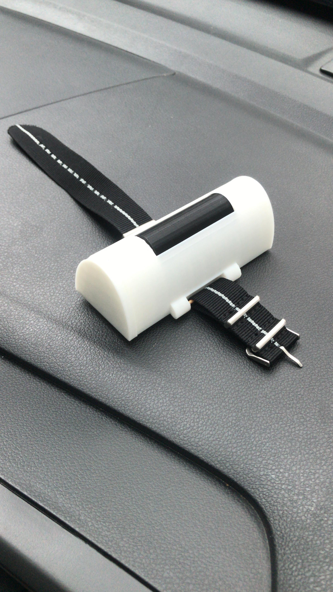

# 🛡️ GEULIS V2: Smart Emergency Bracelet for Elderly Living Alone

  

An IoT-based wearable emergency alert system developed as part of a community-based undergraduate project or KKN (2023–2024), designed to support elderly individuals who live independently—particularly in rural areas such as Purbayan, Yogyakarta.

## 🔍 Project Overview

**GEULIS V1** (Gelang untuk Lansia Hidup Sendiri) is a smart bracelet that enables elderly individuals to send emergency alerts by pressing a button **one times consecutively**. Once triggered, the system automatically sends a WhatsApp message via the [CallMeBot](https://www.callmebot.com/) API to up to **four caregivers**.

### 🎯 Key Features

- 📩 **WhatsApp Notification System**  
  Sends emergency messages via CallMeBot to up to 5 contacts.

- 📶 **WiFi-Based IoT System**  
  No need for smartphone pairing—works autonomously via WiFi.

- 💡 **Low-Cost & Accessible**  
  Built using ESP-32 and minimal components for affordability.

- 🛠️ **Fully Offline Device**  
  Does not require cloud backend or smartphone apps.

- 🧓 **Designed for Elderly Use**  
  One-button interface with minimal user effort required.

## 🛠️ Technical Implementation

| 🔧 Component            | 💻 Implementation                                  |
|-------------------------|---------------------------------------------------|
| Microcontroller         | ESP-32                     |
| Input                   | Tactile Push Button (multi-press detection)       |
| Messaging API           | CallMeBot WhatsApp API via HTTP POST             |
| Programming Environment | Arduino IDE                                      |
| Enclosure Design        | Tinkercad (custom 3D-printed casing)             |
| Power Supply            | 3.7V Li-Ion battery   |
